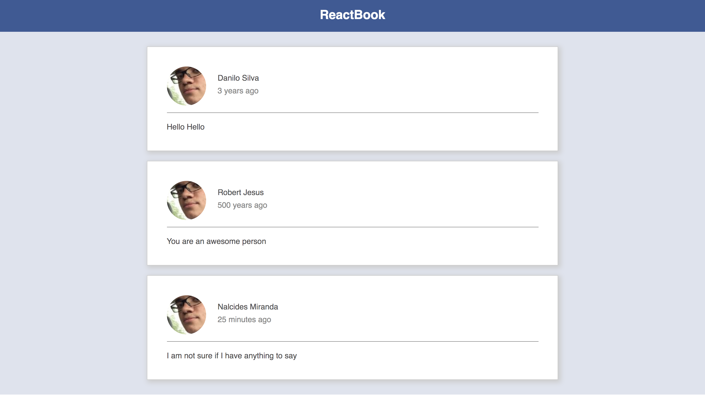

# ReactJS Feed

This is a simple project to being learning reactJS

The purpose was to create a feed similar to facebook's.

Because of it's simplicity, as it was used just to get started with the very
basics of React, you won't see any fancy libraries, no data fetching, no dinamic
data, nothing.

## Project description

The project wasn't created with `create-react-app`. Instead everything was
configured from scratch, from babel and its plugins to webpack and its loaders

## Running project

To run this project locally just clone this project in your machine or fork this
project.

Then, run `npm install` to install all the project's dependencies

After having everything set up, access the project's folder and run the command
`npm run dev`. This will start a webpack dev server in the port `9000`. Access
`localhost:9000` and you may see the project running.
